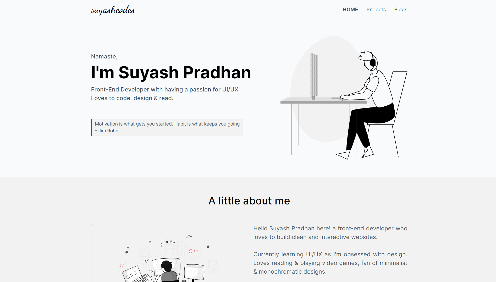

# My Personal Portfolio

I've designed this using my custom CSS library know as "minimalist-CSS". The library is currently running v1 and eventually, I'll add more features. 

If you like this framework just drop a star on GitHub and share your feedback, feedbacks are always welcome.

Library:[https://minimalist-css.netlify.app/]
Library Download Link : [https://gofile.io/d/JowCwB]
Library Gihub Repo: [https://github.com/suyashpradhan/minimalist-css]

---------
### Markup and Styles

1. Semantic HTML
2. Core CSS
3. Responsive
4. All Browser Support

### If you want to share your feedback then connect with me on following social accounts

[Linkedin] (https://www.linkedin.com/in/suyashpradhan/)
[Twitter] (https://twitter.com/SuyashPradhan9)

----

#### THANK YOU!!!